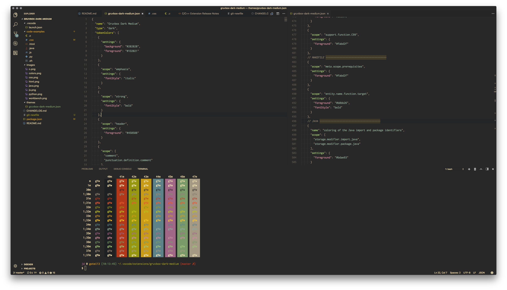
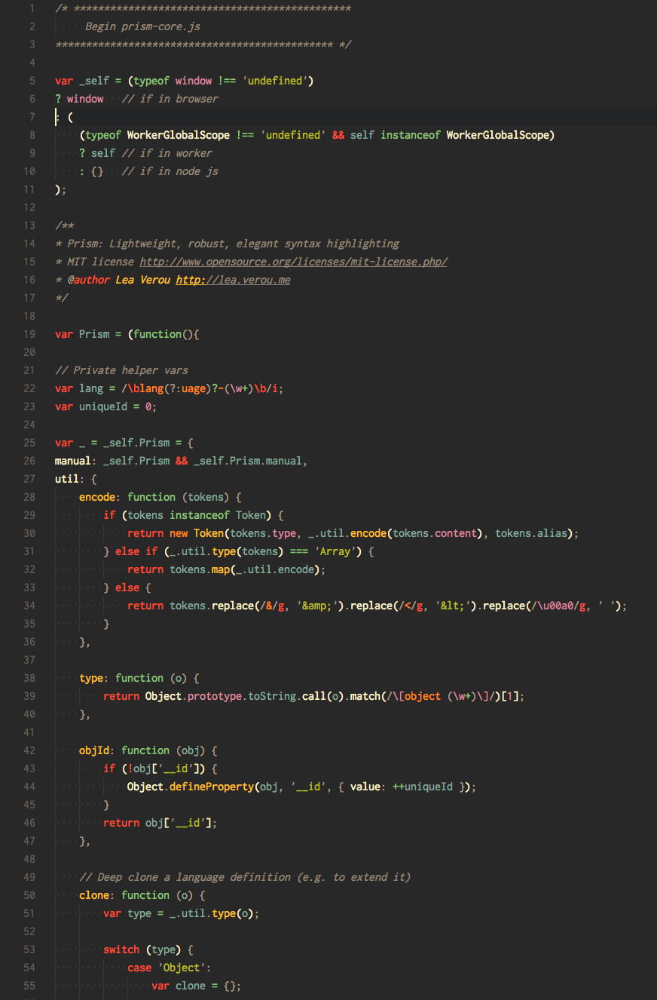
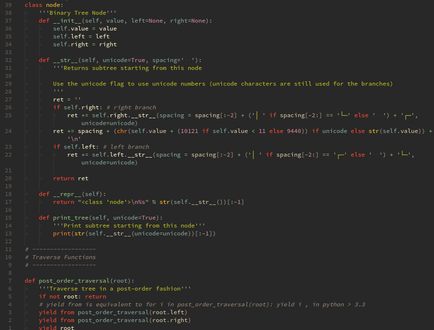
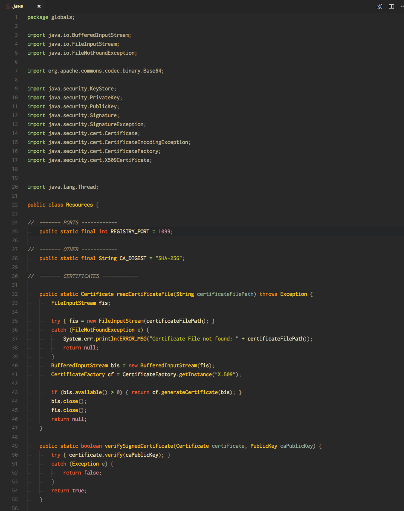
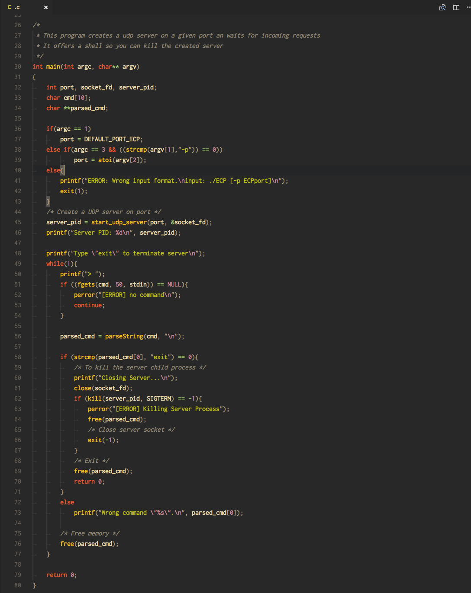
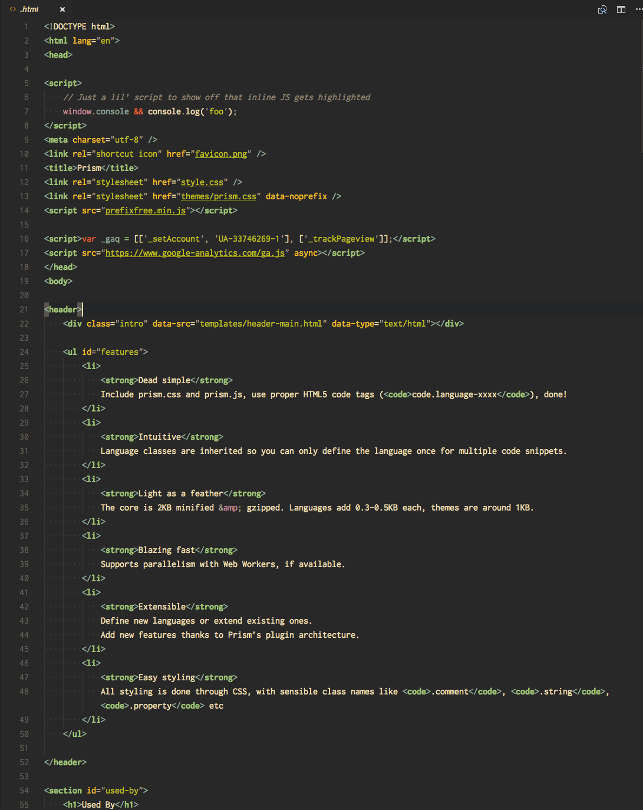
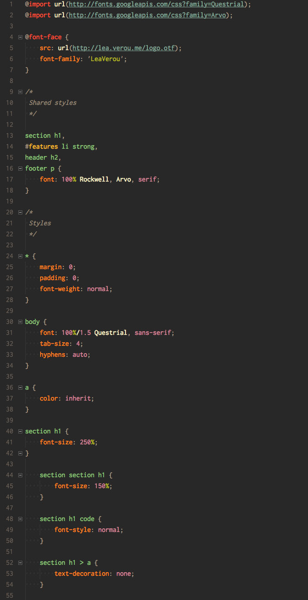
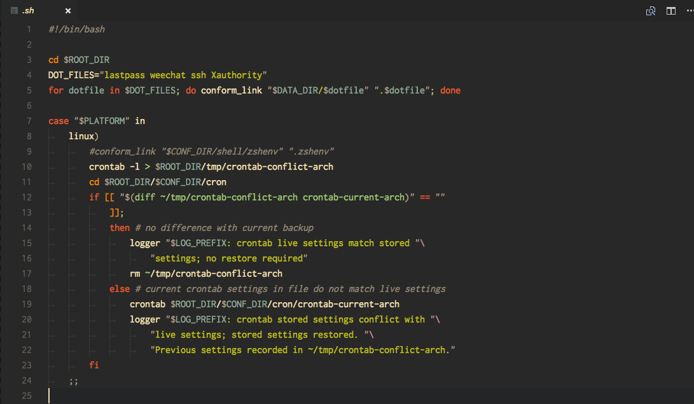
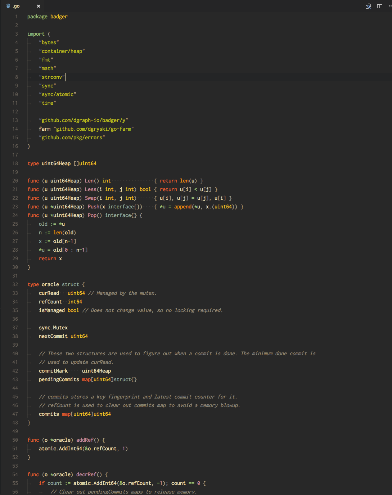

# Gruvbox Theme

## Variants

All 6 Variants:

-   Dark - Medium Contrast
-   Dark - Hard Contrast
-   Dark - Soft Contrast
-   Light - Medium Contrast
-   Light - Hard Contrast
-   Light - Soft Contrast

We're not users of Light versions so we need help to make light versions better. Please contribute if you have any sugegstions.

## Screenshots (Dark Medium Contrast)

### JS

### Python

### Java

### C

### HTML

### CSS

### Bash

### Go

## About

Gruvbox Theme

Please refer to screenshots to see examples of languages this theme's been used on.

Other languages haven't been tested against, but PRs are welcomed.
To contribute, please try opening sample codes from the language you're trying to use in both `vim` (or `sublime-text`) (with `Dark Medium Contrast Gruvbox`) and `vscode`, then try matching them as much as possible.

## Tips

-   In the `json` file, `scope` can be an `array` or a `string` of CSS classes
-   VSCode's `Developer: Inspect TM Scopes` command is useful to find out the scope

## Thank Yous

Special thank to the creator of [gruvbox](https://github.com/morhetz/gruvbox)

### Contributors

-   [eximus](https://github.com/3ximus)
